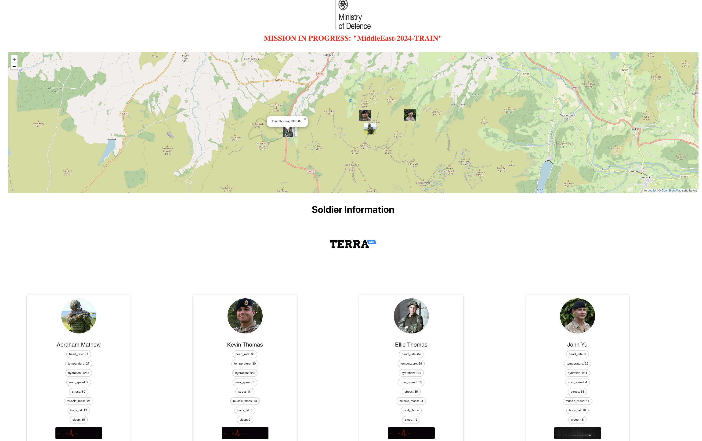

# Militerra

View the product explainer: https://www.youtube.com/watch?v=dZs2Pi9mrj8

## Test it out!

To install dependencies:

```
pip3 -r requirements.txt
```

Install ngrok (if deploying online) macOS, login and follow steps: https://dashboard.ngrok.com/get-started/setup/


To run server:

```
uvicorn main.app --reload
```

To run soldier and commander dashboards:

```
npm run start
```


